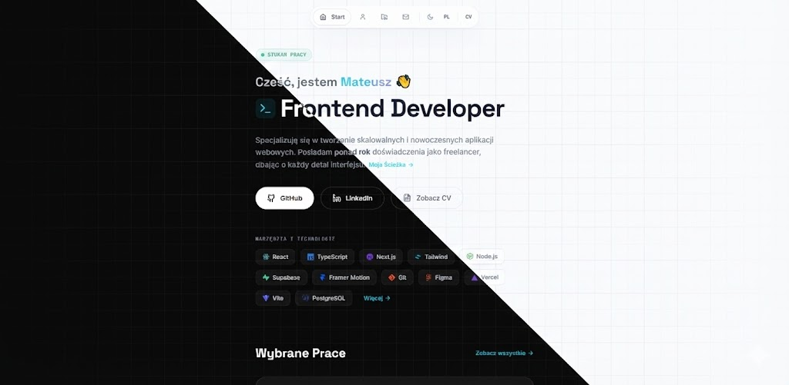
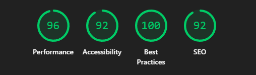

# Mateusz Gałuszka - Portfolio

Nowoczesna strona portfolio dla Frontend Developera, zbudowana w celu profesjonalnej prezentacji projektów i umiejętności. Aplikacja wyróżnia się minimalistycznym designem, płynnymi animacjami oraz wysoką wydajnością.



## Demo

Zobacz aplikację na żywo: **[matikgal.github.io/portfolio](https://matikgal.github.io/portfolio/)**

---

## Instalacja i uruchomienie

```bash
# Klonowanie repozytorium
git clone https://github.com/matikgal/portfolio.git

# Przejście do folderu projektu
cd portfolio

# Instalacja zależności
npm install

# Uruchomienie serwera deweloperskiego
npm run dev
```

Aplikacja będzie dostępna pod adresem `http://localhost:5173`

### Pozostałe komendy

```bash
# Build produkcyjny
npm run build

# Deploy na GitHub Pages
npm run deploy
```

---

## Wydajność (Lighthouse)

Aplikacja została zoptymalizowana pod kątem Core Web Vitals:



> _Wyniki mogą się nieznacznie różnić w zależności od środowiska testowego._

---

## Struktura projektu

```
portfolio/
├── public/                 # Pliki statyczne
├── src/
│   ├── assets/             # Obrazy, ikony, CV.pdf
│   ├── components/         # Komponenty UI (Navbar, Footer, etc.)
│   │   └── ui/             # Atomowe komponenty (PageLoader, Toast)
│   ├── context/            # React Context (AppContext, ScrollContext)
│   ├── data/               # Dane statyczne (projekty, tłumaczenia)
│   ├── pages/              # Strony aplikacji (Hero, About, Projects, Contact)
│   ├── types/              # Definicje TypeScript
│   ├── App.tsx             # Główny komponent aplikacji
│   ├── index.tsx           # Punkt wejścia
│   └── index.css           # Style globalne
├── package.json
├── tailwind.config.js
├── tsconfig.json
└── vite.config.ts
```

---

## Technologie

| Kategoria    | Technologie                                                                                                                                                                                                                                                                                                                                                         |
| ------------ | ------------------------------------------------------------------------------------------------------------------------------------------------------------------------------------------------------------------------------------------------------------------------------------------------------------------------------------------------------------------- |
| **Frontend** |    |
| **Animacje** |                                                                                                                                                                                                                                                    |
| **Build**    |                                                                                                                                                                                                                                                               |
| **Routing**  |                                                                                                                                                                                                                                              |

---

## Główne funkcjonalności

- **Dark/Light Mode** - pełna obsługa motywów
- **Dwujęzyczność (PL/EN)** - dynamiczne przełączanie języka
- **Command Palette** - szybka nawigacja (`Ctrl + K`)
- **Płynne animacje** - page transitions i micro-interactions
- **Mobile First** - pełna responsywność
- **WCAG 2.2+** - wsparcie dla dostępności
- **SEO Ready** - meta tagi i semantyczny HTML

---

## Licencja

Ten projekt jest udostępniony na licencji **MIT**.

```
MIT License

Copyright (c) 2024-2026 Mateusz Gałuszka

Permission is hereby granted, free of charge, to any person obtaining a copy
of this software and associated documentation files (the "Software"), to deal
in the Software without restriction, including without limitation the rights
to use, copy, modify, merge, publish, distribute, sublicense, and/or sell
copies of the Software, and to permit persons to whom the Software is
furnished to do so, subject to the following conditions:

The above copyright notice and this permission notice shall be included in all
copies or substantial portions of the Software.

THE SOFTWARE IS PROVIDED "AS IS", WITHOUT WARRANTY OF ANY KIND, EXPRESS OR
IMPLIED, INCLUDING BUT NOT LIMITED TO THE WARRANTIES OF MERCHANTABILITY,
FITNESS FOR A PARTICULAR PURPOSE AND NONINFRINGEMENT. IN NO EVENT SHALL THE
AUTHORS OR COPYRIGHT HOLDERS BE LIABLE FOR ANY CLAIM, DAMAGES OR OTHER
LIABILITY, WHETHER IN AN ACTION OF CONTRACT, TORT OR OTHERWISE, ARISING FROM,
OUT OF OR IN CONNECTION WITH THE SOFTWARE OR THE USE OR OTHER DEALINGS IN THE
SOFTWARE.
```

---

## Kontakt

**Email:** mateusz.galuszka21@gmail.com  
**LinkedIn:** [Mateusz Gałuszka](https://www.linkedin.com/in/mateusz-ga%C5%82uszka-981900231/)  
**GitHub:** [matikgal](https://github.com/matikgal)

---

_Stworzone przez Mateusz Gałuszka_
